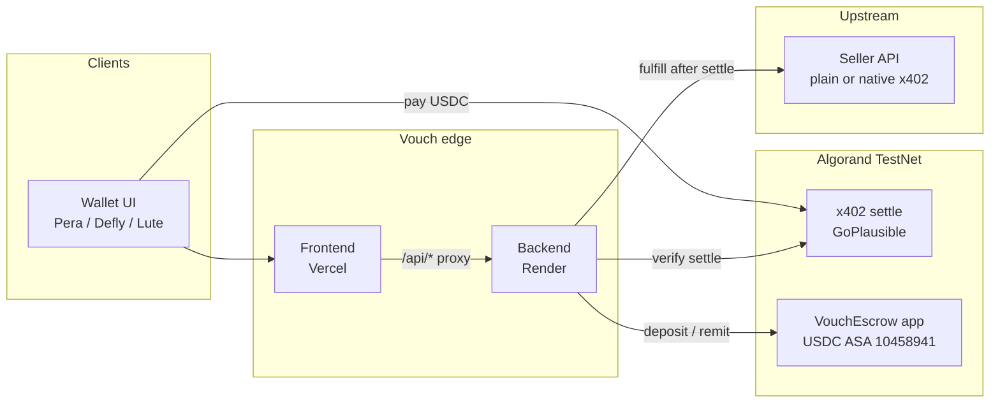

# Vouch

**Referral middleware for [x402](https://x402.org) APIs on Algorand TestNet.**

Agents only ever hit Vouch (`/r/:sellerId/resource`, `/go/:code`). Sellers keep their upstream private. Referral value is settled with real Testnet USDC — either as a cheaper quote (plain) or as an on-chain escrow remit after full-price native settle.

[](https://x402vouch.vercel.app/demo)
[](https://vouch-obr5.onrender.com/health)
[](https://lora.algokit.io/testnet)
[](https://lora.algokit.io/testnet/asset/10458941)
[](./package.json)

---

## Live deployment

| Surface | URL |
|---|---|
| **Web app** | https://x402vouch.vercel.app |
| **Demo cycles** | https://x402vouch.vercel.app/demo |
| **Register seller** | https://x402vouch.vercel.app/register |
| **API** | https://vouch-obr5.onrender.com |
| **API health** | https://vouch-obr5.onrender.com/health |
| **Seller demo** | https://vouch-1-wwxe.onrender.com |
| **Escrow app** | [`769014186`](https://lora.algokit.io/testnet/application/769014186) on TestNet |

> Free Render services sleep when idle and wipe **in-memory** seller/referral state. Re-register + re-fund escrow after a cold start, or keep API/seller on an always-on plan.

---

## Architecture



### Request path

```text
Wallet  →  Vercel (UI)  →  /api/*  →  Render API (:4000)
                                      ├─ x402 challenge + settle (GoPlausible)
                                      ├─ signed referral credential → /go/:code
                                      ├─ VouchEscrow deposit / remit / withdraw
                                      └─ upstream seller (seller-demo or real)
```

Agents never see the seller’s private URL. Native sellers still receive **full list price** on-chain; Vouch remits rebate + commission from seller-prepaid escrow after settle.

---

## How it works

### Native cycle (core)

1. **Register** a native x402 resource (probe discovers `payTo` + price).
2. **Fund escrow** with the seller `payTo` wallet (grouped app deposit — not a plain USDC send).
3. **Agent A** pays full list → seller wallet.
4. **Agent A** signs a 0 ALGO self-pay note → short link `/go/:code` (binds referrer cryptographically).
5. **Agent B** pays full list again via the link.
6. After settle, the operator remits **buyer rebate + referrer commission** from escrow on-chain.

Economics (defaults): list `$0.05`, discount **20%** (`$0.01` rebate), commission **8%** of list (`$0.004`) ≈ **`$0.014`** per Agent B cycle from escrow.

### Plain cycle (secondary)

1. Register a private HTTP endpoint + receiving address.
2. Agent A pays full through Vouch → mint referral.
3. Agent B pays a **discounted** Vouch quote (discount in the 402 amount). Upstream stays hidden.

### Why the referral signature?

Creating a link is not a second USDC charge. Agent A signs a **0 ALGO self-pay** so the referral token proves which address earned commission — otherwise anyone could forge referrer claims and drain escrow.

---

## Monorepo

```text
apps/
  backend/       @vouch/backend       x402 middleware, referrals, escrow operator
  frontend/      @vouch/frontend      wallet UI (Vite + React)
  seller-demo/   @vouch/seller-demo   mock plain + native x402 seller
contracts/
  escrow/        Puya VouchEscrow     on-chain USDC vault (per-seller boxes)
docs/
  PRODUCT.md     product brief
  DESIGN.md      design system
  DEPLOY_RENDER.md
scripts/
  demo-flow.sh
render.yaml      Render Blueprint (API + seller + optional static)
vercel.json      Vercel (UI + /api proxy → Render)
```

| Package | Role | Default port |
|---|---|---|
| `@vouch/frontend` | Demo UI, Register, Ledger | `5173` |
| `@vouch/backend` | Public agent surface + escrow ops | `4000` |
| `@vouch/seller-demo` | Upstream used after settle | `4001` |

---

## Local development

**Requirements:** Node `>=20`, TestNet ALGO + USDC ASA `10458941` opted in, Pera/Defly/Lute.

```bash
git clone https://github.com/Caerlower/Vouch.git
cd Vouch
npm install

cp apps/backend/.env.example apps/backend/.env
# Set at minimum:
#   VOUCH_PAY_TO              # TestNet address opted into USDC
#   VOUCH_FULFILL_SECRET      # openssl rand -hex 32  (same on seller)
#   VOUCH_OPERATOR_* / ESCROW_APP_ID after deploy:escrow

# Optional seller env (matches fulfill secret)
cp apps/backend/.env apps/seller-demo/.env   # or set VOUCH_FULFILL_SECRET only

npm run deploy:escrow    # needs funded operator; writes ESCROW_APP_ID into .env
npm run dev:seller       # http://localhost:4001
npm run dev:backend      # http://localhost:4000
npm run dev:frontend     # http://localhost:5173
```

Open http://localhost:5173/demo → **Native** or **Plain**.

For local seller fulfill HMAC, put the same `VOUCH_FULFILL_SECRET` in `apps/seller-demo/.env`.

---

## API surface

| Method | Path | Description |
|---|---|---|
| `GET` | `/health` | Service + escrow status |
| `GET` | `/r/:sellerId/resource?ref=` | Paid resource (x402) |
| `GET` | `/quote?ref=&sellerId=` | Pricing preview |
| `GET` | `/links/:code` | Resolve short referral |
| `POST` | `/referrals/prepare` | Unsigned referral payload for wallet |
| `POST` | `/referrals/assemble` | Attach signed txn → short URL |
| `POST` | `/sellers` · `POST /sellers/probe` | Register / probe native 402 |
| `POST` | `/escrow/:id/deposit/prepare` | Unsigned deposit group |
| `POST` | `/escrow/:id/deposit` | Record deposit after wallet submit |
| `GET` | `/escrow/:id` | Per-seller escrow snapshot |
| `GET` | `/remit/:settleTxId` | Lookup post-settle escrow remit |
| `GET` | `/stats/:address` · `/ledger` | Earnings / proof |

`POST /remit` from clients is **disabled**. Remits run only in `onAfterSettle` after a verified x402 payment.

---

## Escrow trust model

| On-chain | Off-chain (Vouch) |
|---|---|
| USDC deposits into app boxes | Referral eligibility / nonce |
| Remit inner transfers (rebate + commission) | Operator signs remit after settle |
| Withdraw to registered seller owner | `x-vouch-operator-key` for withdraw API |

This is intentional **middleware**: the escrow holds real funds; referral policy is enforced by `@vouch/backend`, not a trustless on-chain oracle.

Explorer: [app `769014186`](https://lora.algokit.io/testnet/application/769014186) · [USDC ASA `10458941`](https://lora.algokit.io/testnet/asset/10458941)

---

## Production deploy

| Component | Host | Notes |
|---|---|---|
| Frontend | [Vercel](https://vercel.com) — `x402vouch.vercel.app` | `/api/*` proxied to Render API |
| Backend | [Render](https://render.com) — `vouch-obr5` | Set secrets from `.env`; `PUBLIC_SITE_URL` = Vercel URL (**no trailing slash**) |
| Seller demo | Render — `vouch-1-wwxe` | Same `VOUCH_FULFILL_SECRET` as API |

Blueprint: [`render.yaml`](./render.yaml). Step-by-step env checklist: [`docs/DEPLOY_RENDER.md`](./docs/DEPLOY_RENDER.md).

Required secrets (never commit):

- `VOUCH_PAY_TO` / `NATIVE_PAY_TO`
- `VOUCH_FULFILL_SECRET`
- `ESCROW_APP_ID`, `VOUCH_OPERATOR_MNEMONIC`, `VOUCH_OPERATOR_ADDRESS`
- `VOUCH_OPERATOR_API_KEY`
- `PUBLIC_SITE_URL`, `SELLER_SERVICE_URL`

---

## Tech stack

- **Chain:** Algorand TestNet, USDC ASA `10458941`, [@x402-avm](https://www.npmjs.com/package/@x402-avm/core), GoPlausible facilitator
- **Contracts:** Puya / AlgoKit (`contracts/escrow`)
- **Backend:** Node 20+, Express, TypeScript
- **Frontend:** Vite, React, Tailwind, `@txnlab/use-wallet`
- **Hosting:** Vercel (UI) + Render (API + seller)

---

## Docs

- [Product](./docs/PRODUCT.md)
- [Design](./docs/DESIGN.md)
- [Deploy on Render](./docs/DEPLOY_RENDER.md)
- [Escrow contract](./contracts/escrow/README.md)

---

## License

MIT
